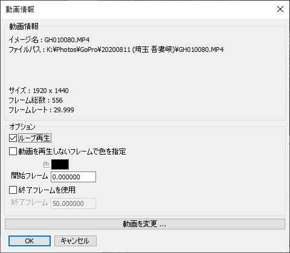

# Video Importer for Shade3D

Shade3Dに動画ファイル（mp4/webm/mov）を読み込み、動画テクスチャとしてレンダリングに反映するプラグインです。    
本プラグインは動画出力でOpenCV 4.5.0 ( https://opencv.org/ )を使用しています。    

## 機能

以下の機能があります。    

* 動画ファイル(mp4/webm、Windows環境では加えてmov)をシーンに外部参照としてインポートし、マスターイメージにします。    
* 読み込んだ動画は、レンダリング時に動画テクスチャとして反映できます。     
* レンダリング時に、動画の開始フレーム位置/終了フレーム位置の指定ができます。
* レンダリング時に、動画のループ再生の指定ができます。
* レンダリング時に、動画の開始フレーム/終了フレーム外の場合に、指定の色で塗りつぶすことができます。    

## 動作環境

* Windows 7/8/10以降のOS
* macOS 10.11以降
* Shade3D ver.14以降で、Standard/Professional版（Basic版では動作しません）
* Shade3Dの64bit版のみで使用できます。32bit版のShade3Dには対応していません。

## 起動方法

### プラグインダウンロード

以下からプラグインの最新版をダウンロードしてください。     

https://github.com/ft-lab/Shade3D_VideoImporter/releases

Video Importer for Shade3Dプラグインは、OpenCVの動的ライブラリを参照します。    
起動方法はWindows/Macで異なります。    

### Windows環境の場合

[起動方法 (Windows)](./setup_win.md) をご参照くださいませ。    

### Mac環境の場合

[起動方法 (Mac)](./setup_mac.md) をご参照くださいませ。    

## 使い方

ツールボックスの「作成」-「その他」-「イメージ」でイメージをシーンに読み込む際に、mp4/webm、Windows環境では加えてmovを選択できます。    
     
シーンに「外部参照として」動画ファイルを読み込みます。    
正しく読み込まれた場合は、マスターイメージが生成されます。     
このとき、対象のマスターイメージのラベルに [Video] が付いています。    
     
また、このときの形状情報ウィンドウでは、はじめのフレームが静止画として反映されます。    
このときの「動画情報」は使用されません。    

### 動画情報の確認

ブラウザで [Video] のラベルが付いたマスターイメージを選択し、    
「情報」で「動画情報」を選択します。    
     

動画情報ダイアログボックスが表示されます。    
     

「動画情報」の「イメージ名」はマスターイメージとしての名前です。    
「ファイルパス」は外部参照としての動画ファイルのフルパスです。    
「サイズ」は動画の解像度をピクセル数で表示します。    
「フレーム総数」は動画の全フレームの数です。     
「フレームレート」は動画の1秒間に再生するフレーム数です。    

「オプション」の「ループ再生」チェックボックスをオンにすると、    
動画の最終フレームに来たときに次のフレームは0フレーム目に戻ります。    
同じ動画を繰り返し再生させる場合に有効です。    
「動画を再生しないフレームで色を指定」チェックボックスをオンにすると、    
レンダリングのタイムラインでの「開始フレーム」から「終了フレーム」の間以外のフレーム時は指定の「色」で塗りつぶします。    
レンダリングのタイムラインで「開始フレーム」で指定したフレームまでは動画の再生を行いません。    
「開始フレーム」に達したときに、対象の動画ファイルの0フレーム目から再生が開始されます。     
「終了フレームを使用」チェックボックスをオンにすると、「終了フレーム」を指定できます。     
オフの場合は「終了フレーム」は使用されず、レンダリングのタイムラインの最後まで対象の動画を再生します。    

「動画を変更」ボタンを押すと、mp4/webm、Windowsの場合は加えてmov、を選択するファイルダイアログボックスが表示されます。    
マスターイメージに割り当てている動画は、ここで指定された動画に変更されます。    
なお、「動画を変更」を行った場合は、動画情報ダイアログボックスのキャンセルボタンを押しても反映されます。    

### レンダリング

イメージとしてmp4/webm/movを読み込んだ段階で、標準のレンダリングを行うと動画も反映されます。     
アニメーションレンダリングを行うと、この動画のマスターイメージを割り当てたテクスチャが動画テクスチャとなります。    

## 開始フレームと終了フレーム

動画情報ダイアログボックスの「開始フレーム」と「終了フレーム」は、レンダリングのタイムラインでのフレーム位置指定になります。    
別途、対象の動画ファイル自身のフレームが存在しますが、これとは別です。    
以下のようにレンダリングが300フレームの場合で、
「開始フレーム」が50、「終了フレーム」が230の場合を考えます。    
     
この「開始フレーム」「終了フレーム」「ループ再生」などは、各動画ファイルごとに指定できます。    
アニメーションレンダリングが「開始フレーム」に到達したときに、対象の動画は0フレーム目から再生されます。    
「動画1」（ループ指定なし）の総フレーム数が100フレームの場合は、50+100=150フレームで動画の再生は停止されます。    
「動画2」（ループ再生）の総フレーム数が80フレームの場合は、「動画2」の79フレーム目が再生された後は0フレームに戻ります。    
「終了フレーム」に達したときに動画の再生は停止されます。    
このとき「動画を再生しないフレームで色を指定」チェックボックスをオンにしている場合は、    
「開始フレーム」まで（0-49フレーム）と「終了フレーム」以降(231-299フレーム)は、指定の色で塗られます。    

また、レンダリング時のフレームレートと各動画のフレームレートが異なる場合は、     
レンダリング時のフレームレートに合わせるように各動画のフレーム位置が計算されます。    
結果として、レンダリング時の再生と各動画の元の再生は、同じ速度で経過することになります。    

## 外部参照としての動画ファイルの検索先

動画を読み込んだときに、属性として動画のフルパスが保持されます。     
この絶対パス（フルパス）に存在するファイルがある場合はそれを参照します。    
絶対パスに動画が存在しないときは、
Shade3Dのシーンファイル(shdファイル)があるフォルダ上に同一の動画ファイル名がある場合にそれを参照します。    
shdファイルの環境を移す場合は、動画ファイルも同一フォルダに入れて渡すと動画のレンダリングもそのまま反映されることになります。    

## 参照先の動画が見つからない場合

レンダリング時に動画が存在するかのチェックが行われます。    
もしも正しく動画を読み込めない場合は、メッセージウィンドウにエラーメッセージが表示されます。    
この場合は動画として正しく反映されず、静止画がテクスチャに反映されることになります。     

「動画ファイルの読み込みに失敗しました。」と出る場合は、参照先の動画ファイルが存在しません。    
ブラウザで対象のマスターイメージを選択して、「動画情報」ダイアログボックスで参照先のファイルを確認。    
「動画を変更」ボタンを押して再度動画ファイルを割り当てるようにしてください。    

「指定の動画ファイルは、読み込み時と解像度が異なります。」と出る場合は、動画ファイルは存在しますが解像度が異なります。    
この場合も、対象マスターイメージで再度動画を割り当てるようにしてください。    

## 制限事項

* オーディオ情報は反映されません。    

## ビルド方法 (開発者向け)

プラグインのビルド方法です。    

* [ビルド方法 (Windows)](./build_win.md)
* [ビルド方法 (Mac)](./build_mac.md)

## ライセンス

This software is released under the MIT License, see [LICENSE](./LICENSE).    

### OpenCVのライセンス

OpenCVは「3-clause BSD License」になります。    
https://opencv.org/license/    

### H.264のライセンス

「Video Importer for Shade3D」では、OpenCVの機能を使用してmp4(CODECはH.264)形式の読み込みを行っています。    
本プラグインではH.264にはタッチしていません。    
OpenCVでは、Windows版のmp4(H.264)インポート/エクスポートで「Microsoft Media Foundation (MSMF)」を使用しているようです。    
この場合は特にライセンスはOpenCV側では問われないようです。    

H.264を使用している場合の出力動画の使用については、使い方によってはエンドユーザーとしてのライセンスが必要になる場合があります。    
"AVC Patent Portfolio License" ( https://www.mpegla.com/programs/avc-h-264/license-agreement/ )も参照するようにしてください。    

## 更新履歴

### [2020/11/08] ver.1.0.0.0

* 初回バージョン

